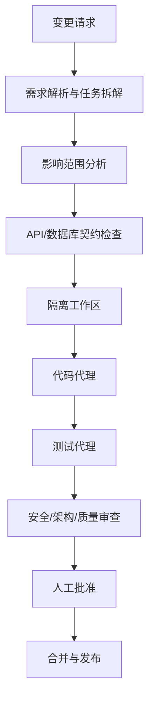

# Agent 挑战题设计（第二阶段）

## 1. 范围声明

多微服务代码修改 Agent 是笔试文档中的扩展挑战，不属于首版核心闭环。首版只提供设计、依赖图、权限边界和执行顺序，不提供声称已经可自动修改生产代码的空实现。

## 2. 目标

给定自然语言变更请求，Agent 能够在隔离工作区中：

- 识别受影响的服务、API、数据库迁移和前端页面；
- 生成实施计划和风险清单；
- 修改代码、测试和文档；
- 运行最小测试、全量测试和构建；
- 输出 diff、测试证据和待人工批准的变更。

## 3. 依赖图

## 4. 执行顺序

1. 读取需求、AGENTS 规则、规格和当前任务状态。
2. 只读扫描代码、测试、迁移和依赖图，形成影响清单。
3. 先写失败测试或契约测试，并让人工确认公共接口变化。
4. 在临时 worktree 中按垂直切片实现，每个切片单独验证和提交。
5. 运行安全扫描，禁止读写未授权目录、密钥和用户数据。
6. 汇总 diff、测试输出、迁移说明、回滚方式和剩余风险。
7. 人工批准后才允许创建 PR 或合并；Agent 不自动绕过保护规则。

## 5. 安全和权限模型

- 默认只读；写操作必须限定在显式工作区。
- 数据库迁移、删除数据、外部发布和权限变化需要人工确认。
- Agent 不读取生产密钥，不把 Prompt、Token、文档正文写入日志。
- 工具调用采用 allowlist，外部 API 使用最小权限和幂等键。
- 所有自动修改都有可回滚 Git 提交和审计记录。

## 6. 评测指标

- 需求覆盖率：强制验收项是否被识别并实现。
- 测试有效性：新增测试是否能在缺陷存在时失败。
- 回归安全：既有测试、构建和迁移是否保持通过。
- 变更最小性：是否触碰无关文件或引入不必要依赖。
- 安全合规：是否泄露秘密、越权访问或执行危险命令。
- 解释质量：是否给出清晰的影响范围、证据、风险和回滚步骤。

## 7. 首版接口预留

当前项目通过任务清单、规格、测试分层和 Git 提交流程为后续 Agent 提供上下文基础。真正的多微服务自动修改、代码执行沙箱、策略审批和发布编排在第二阶段单独立项。