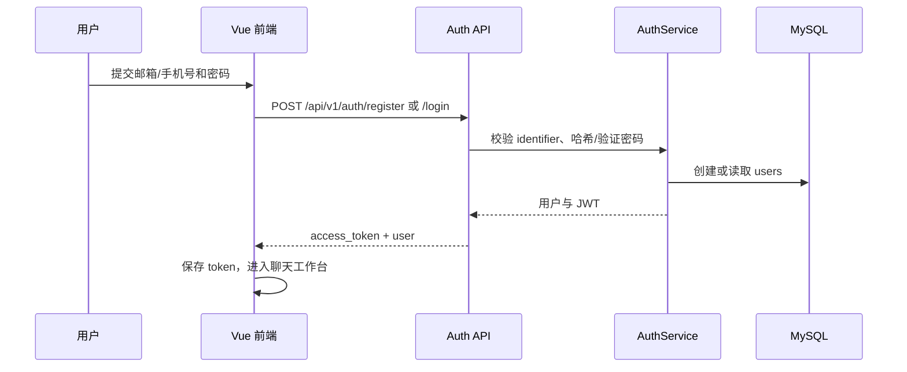
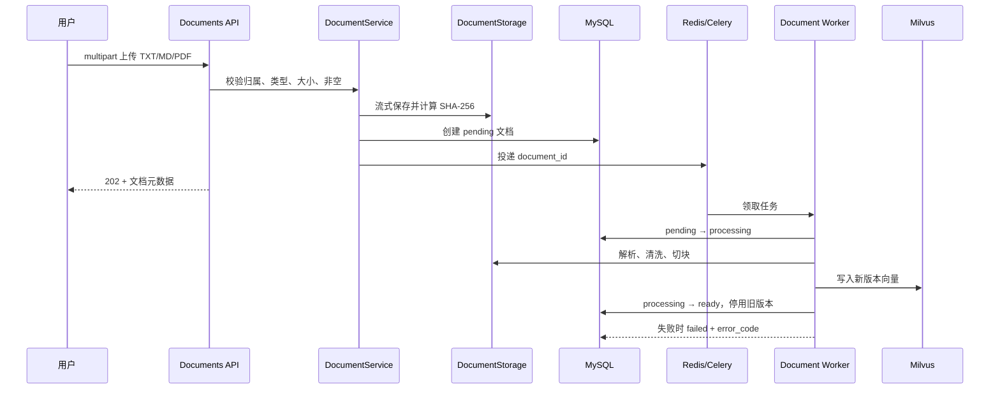
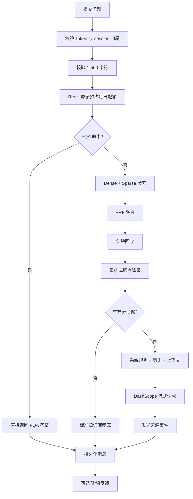

# 业务流程

## 1. 注册与登录



密码只保存 Argon2id 哈希。后端从 Token subject 获取用户 UUID，不信任客户端提交的 `user_id`。

## 2. 文档上传与异步入库



处理状态：`pending`、`processing`、`ready`、`failed`。失败只重试外部临时故障；空文件、格式错误和不支持 OCR 的扫描 PDF 直接失败。删除必须清理向量、原文件和数据库元数据，操作幂等。

## 3. 问答闭环



合法问题计入每日配额；参数校验失败、基础设施失败或 Provider 失败会补偿预占。问候语和精确 FQA 不调用 LLM。

## 4. SSE 事件时序

客户端使用 `fetch` 发起 POST 请求并读取 `text/event-stream`：

```text
event: start   -> request_id, message_id
event: delta   -> text（可多次）
event: source  -> document_id, document_name, page_number, excerpt
event: done    -> message_id, answer_type, retrieval_strategy, latency_ms
```

发生受控异常时返回 `event: error`，事件中只包含稳定错误码、安全提示和 request_id。Provider 产生的片段会立即转发，不能把完整答案拆成伪流式字符。

## 5. 删除后的可见性

删除文档后，文档列表不再返回可用记录；Milvus 中按 `document_id` 清理实体；检索额外过滤 `user_id`、`active_version` 和 `source_filter`。因此删除后的相同问题只能进入 fallback，不会继续引用旧版本。