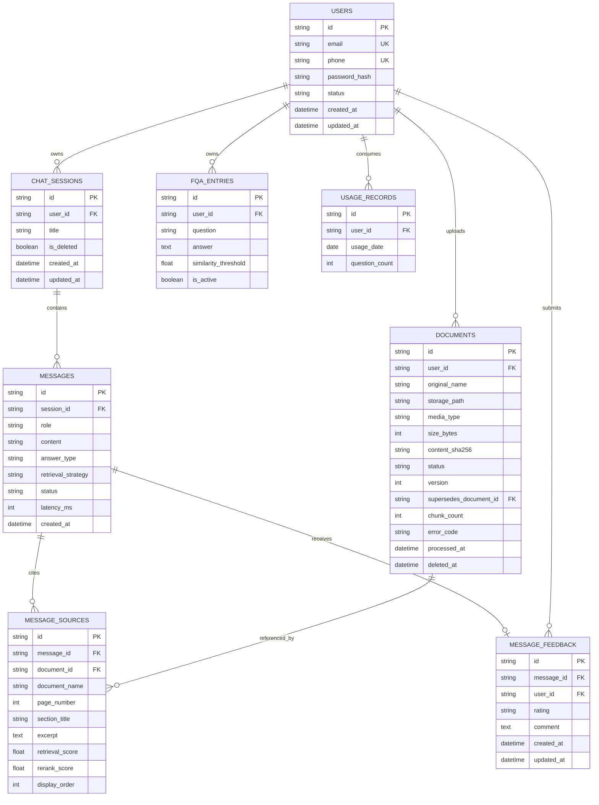

# 数据库设计

## 1. ER 图

## 2. 约束和索引

- 所有业务主键为 UUID 字符串；时间由 UTC 生成。
- `users.email`、`users.phone` 唯一；服务层保证至少一个标识存在。
- 资源表通过 `user_id` 或所属会话回查当前 Token 用户，禁止客户端越权。
- `chat_sessions.user_id`、`messages.session_id`、`message_sources.message_id/document_id`、`message_feedback.message_id/user_id`、`documents.user_id`、`fqa_entries.user_id`、`usage_records.user_id` 建索引。
- `message_feedback(message_id,user_id)` 唯一，保证同一用户只能保留一条当前反馈。
- `usage_records(user_id,usage_date)` 唯一，保证每日配额幂等。
- 数据库结构变化通过 `backend/migrations/versions/` 的 Alembic 迁移完成。

## 3. 生命周期

### 文档

`pending → processing → ready`；处理异常为 `failed`；删除过程可进入 `deleting`。新版本入库成功后，旧版本停止参与检索。删除按向量、文件、数据库元数据三层清理，并允许重试。

### 消息

用户消息和 AI 消息分别持久化。流式回答开始时创建临时 assistant ID；正常结束为 `completed`，异常为 `failed`。来源记录挂在 assistant message 下，反馈通过唯一约束更新。

### 用量

Redis 执行快速原子预占，MySQL `usage_records` 保存持久化计数。问答成功后保留计数；参数校验或基础设施失败时补偿预占。

## 4. 删除和隔离

数据库软删除字段用于会话和文档历史审计；检索层不返回已删除、非 active version 或其他用户的向量。任何查询、详情、删除和反馈操作都必须先通过当前用户归属校验。