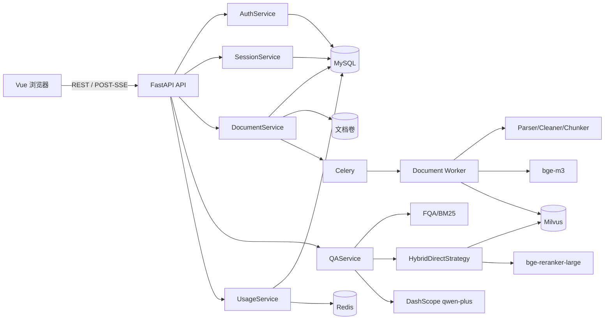

# 项目总览

## 定位

AI 智能客服系统是一个面向企业知识库的多轮对话应用。首版围绕“用户登录—知识文档入库—FQA/RAG 问答—来源引用—反馈—历史持久化”核心闭环交付，原始笔试文档《AI开发工程师笔试题.docx》是需求和验收第一标准。

## 首版交付范围

- 邮箱或中国大陆手机号注册、登录、JWT 鉴权。
- 独立会话创建、列表、详情、删除和历史消息。
- TXT、Markdown、PDF 文档上传、异步状态查询、删除。
- 文档解析、清洗、父子块切分、Embedding、Milvus 版本化入库。
- FQA 优先，未命中后进入 Dense + Sparse 混合检索 RAG。
- RRF 融合、父块回收、重排降级、证据型 Prompt 和 DashScope `qwen-plus`。
- POST + SSE 真实流式输出 `start/delta/source/done/error`。
- 来源文档、页码/章节、片段摘要、赞/踩反馈、每日问答配额。
- Docker Compose 基础设施模式和完整 `app` profile。

第二阶段仅保留接口和设计：图片识别、追问建议、多知识库路由、HyDE、子查询、回溯检索、RAGAS 和代码修改 Agent，不在首版伪装为已实现功能。

## 技术栈

| 层 | 技术 |
| --- | --- |
| 前端 | Vue 3、TypeScript、Vite、Pinia、Vue Router |
| 后端 | Python 3.12、FastAPI、Pydantic v2 |
| 数据访问 | SQLAlchemy 2.x、Alembic、PyMySQL |
| 认证 | Argon2id、JWT access token |
| 基础设施 | MySQL 8.4、Redis 7.4、Milvus 2.4、etcd、MinIO |
| 异步任务 | Celery 5，Redis broker/result backend |
| AI | 本地 bge-m3、bge-reranker-large、DashScope qwen-plus |
| 测试 | pytest、Vitest、Playwright |

## 架构边界



API 层只负责协议、鉴权和错误映射；Service 编排业务事务；Adapter 隔离 MySQL、Redis、Milvus、文件存储和模型；RAG 模块通过类型化契约工作，不依赖 FastAPI 请求对象。

## 目录

```text
cs_rag_agent/
├── backend/app/api/          # REST、SSE 和健康检查
├── backend/app/services/     # 认证、会话、文档、配额、问答编排
├── backend/app/rag/          # 解析、清洗、切分、检索、Prompt
├── backend/app/adapters/     # 外部存储、向量、Embedding、LLM、重排
├── backend/app/workers/      # Celery 文档异步入库
├── backend/migrations/       # Alembic 迁移
├── backend/tests/            # 单元、集成和后端 E2E
├── frontend/src/             # Vue 页面、组件、Pinia 和 API 客户端
├── frontend/tests/           # Vitest 与 Playwright
├── sample-data/              # 可安全提交的中文示例知识文档
├── docs/                     # 项目、架构、API、部署和验收文档
├── docker-compose.yml        # 基础设施模式和 app profile
└── tasks/todo.md             # 分阶段任务清单
```

## 快速入口

- 开发部署：[部署说明](deployment.md)
- API 契约：[API 文档](api.md)
- RAG 设计：[AI 架构](ai-architecture.md)
- 数据模型：[数据库文档](database.md)
- 用户流程：[业务流程](business-flow.md)
- 测试验收：[测试文档](testing.md)
- AI 使用记录：[AI 使用说明](ai-usage.md)
- Agent 挑战设计：[Agent 挑战](agent-challenge.md)

## 运行原则

1. 先创建 Python 虚拟环境，再安装依赖。
2. 真实密钥只写本地 `.env`，不提交仓库。
3. 模型权重从宿主机目录只读挂载，不复制到镜像。
4. 数据库结构变化只通过 Alembic 迁移。
5. 每个用户资源都按 JWT 当前用户隔离。
6. 没有证据时必须返回标准 fallback，不能让 LLM 自由编造业务事实。